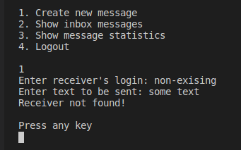
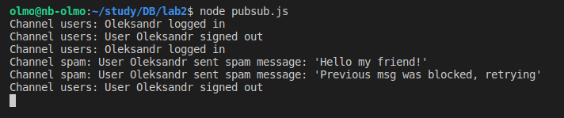

# Лабораторна робота 2. Практика використання серверу Redis

## Завдання 

[Посилання на завдання](http://scs.kpi.ua/sites/default/files/lab2_bd2-db2019_2020.pdf)

## Обгрунтування вибору структур даних

Для представлення користувачів в системі було обрано HASH, так як ця структура дозволяє зберігати ключ та значення. Ключем виступає id користувача, а значенням - username та лічильники для відстеження статистики повідомлень за статусом (“Створено”, “У черзі”, “Перевіряється на спам”, “Заблоковано через спам”, “Відправлено адресату”, “Доставлено адресату”).

Для зберігання даних про повідомлення, було вирішено для кожного экземпляра створювати HASH, який зберігає інформацію про id відправника та отримувача, а також саме повідомлення. Для того, щоб генерувати для кожної такої структури унікальний ключ, було використано звичайну строку, яку кожен раз при додаванні нового повідомлення збільшуємо на одиницю.

Для відображення користувачу вхідних повідомлень (які надійшли саме йому) було обрано LIST, адже він дозволяє зберігати хронологічний порядок появи нових повідомлень.

Для того, щоби мати можливість спостерігати відсортований рейтинг користувачів відповідно до їх активності (надісланих повідомлень/спаму), було обрано структуру даних відсортований сет, тобто ZSET, адже саме він зберігає ключі у відсортованому вигляді за певним значенням.

Для журналу повідомлень було використано Pub/Sub, адже завдяки цьому будь-хто може стати publisher-ом і відправляти повідомлення, які слухач відразу ж прочитає, адже він підписаний на відповідний канал. Це дає змогу створювати додатки, які в реалтаймі будуть оновлюватися, адже як тільки-но дані будуть опубліковані, клієнт зможе їх миттєво прочитати та відповідно опрацювати їх.

Для черги повідомлень було використано LIST, адже ця структура даних зберігає порядок, а операції вставлення в кінець та вилучення з початку займають О(1) часу.

Приклади роботи програми:

